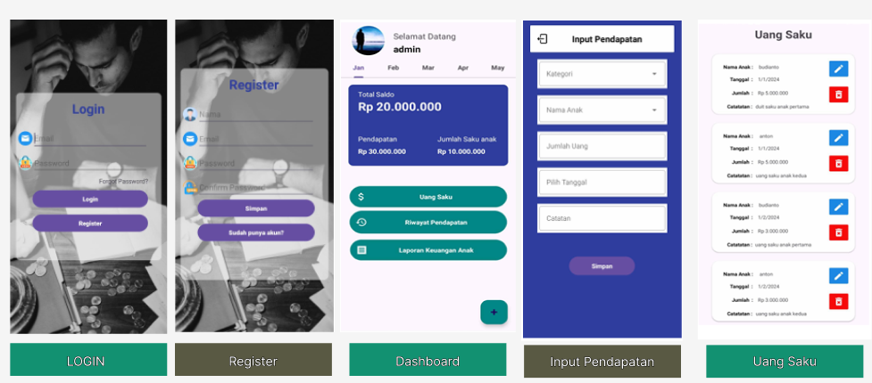
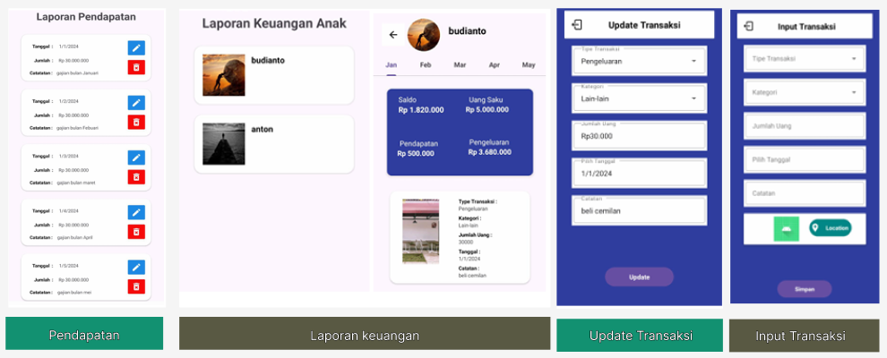

# Dompet Keluarga

Aplikasi Android berbasis Kotlin yang dirancang untuk membantu keluarga dalam mengelola keuangan sehari-hari. Aplikasi ini memungkinkan orang tua untuk mencatat pendapatan, membagikan uang saku kepada anak, serta memantau riwayat transaksi dan saldo keuangan keluarga secara terintegrasi.

## Fitur Utama

### Admin (Orang Tua)
- Login sebagai admin.
- Menambahkan data pendapatan.
- Membagikan uang saku kepada anak.
- Melihat total pendapatan, total uang saku, dan saldo tersisa.
- Mengelola data pendapatan (tambah, edit, hapus).
- Mengelola data uang saku anak (tambah, edit, hapus).
- Melihat laporan keuangan dan riwayat transaksi setiap anak.
- Mengubah foto profil menggunakan kamera atau galeri.
- Registrasi akun admin baru.

### User (Anak)
- Registrasi dan login akun.
- Menambahkan transaksi pendapatan dan pengeluaran.
- Melihat saldo, total pendapatan, dan total pengeluaran.
- Mengelola transaksi pribadi (tambah, edit, hapus).
- Melihat riwayat transaksi.
- Mengubah foto profil menggunakan kamera atau galeri.

## Teknologi yang Digunakan

- Kotlin
- Android Studio
- Firebase Authentication
- Firebase Realtime Database
- Firebase Storage
- RecyclerView
- Fragment
- Material Design

## Struktur Database

### Users
Menyimpan informasi akun pengguna seperti email, nama, foto profil, dan role pengguna.

### Transactions
Menyimpan data transaksi pendapatan dan pengeluaran pengguna, termasuk kategori, nominal, tanggal, catatan, dan lokasi.

### Transactions Admin
Menyimpan data pendapatan admin serta distribusi uang saku kepada pengguna.

## Penyimpanan Firebase

### Firebase Authentication
Digunakan untuk proses registrasi dan login pengguna.

### Firebase Realtime Database
Digunakan untuk menyimpan data pengguna, transaksi, pendapatan, dan uang saku.

### Firebase Storage
Digunakan untuk menyimpan foto profil dan gambar yang terkait dengan transaksi.

## Cara Menjalankan Project

1. Clone repository:

   ```bash
   git clone https://github.com/ys124xkd/Dompet_keluarga.git
   ```

2. Buka project menggunakan Android Studio.

3. Tambahkan file `google-services.json` sesuai konfigurasi Firebase.

4. Lakukan sinkronisasi Gradle.

5. Jalankan aplikasi pada emulator atau perangkat Android.

## Screenshot

### Desain 1


### Desain 2
.

## Lisensi

Project ini dibuat untuk tujuan pembelajaran dan pengembangan aplikasi Android.
